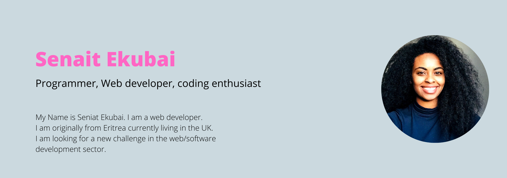

<h1>Hi, I am Senait 👋</h1>

<h3>Get in touch</h3>

<h3>Languages and tools</h3>
<em>
Note: These are the skills i have learned so far. I am still leaning new technologies and tools. This is why I love coding, you never stop learning.

</em>

<h3>Stats</h3>

